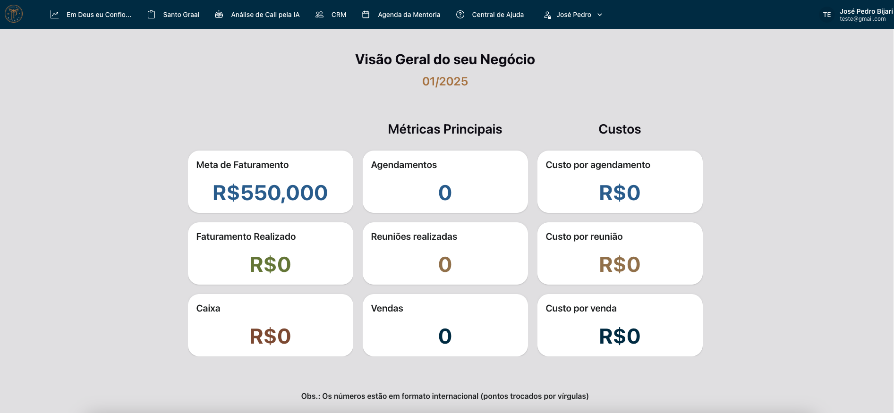
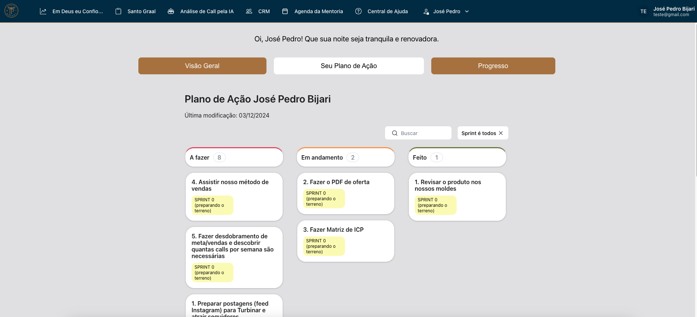
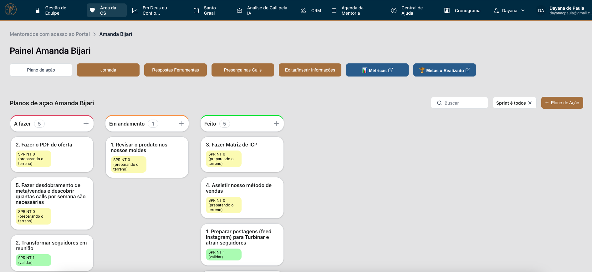
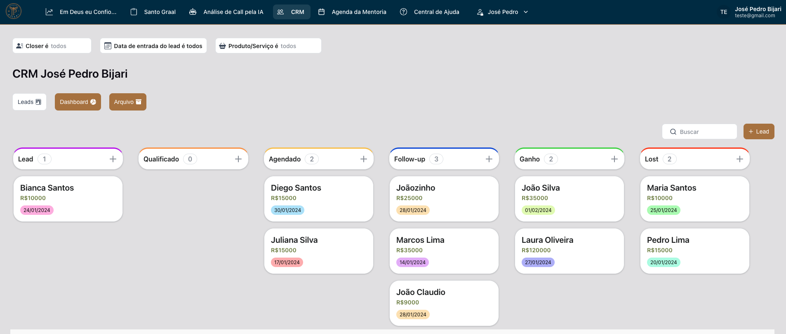
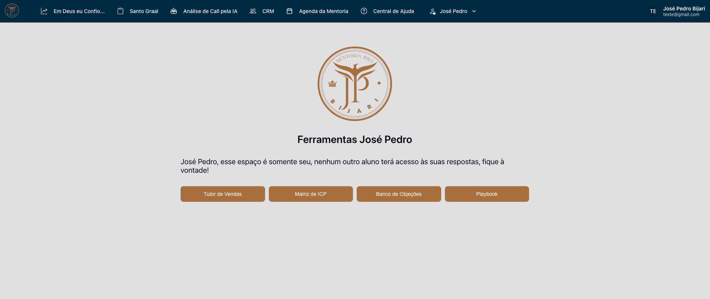
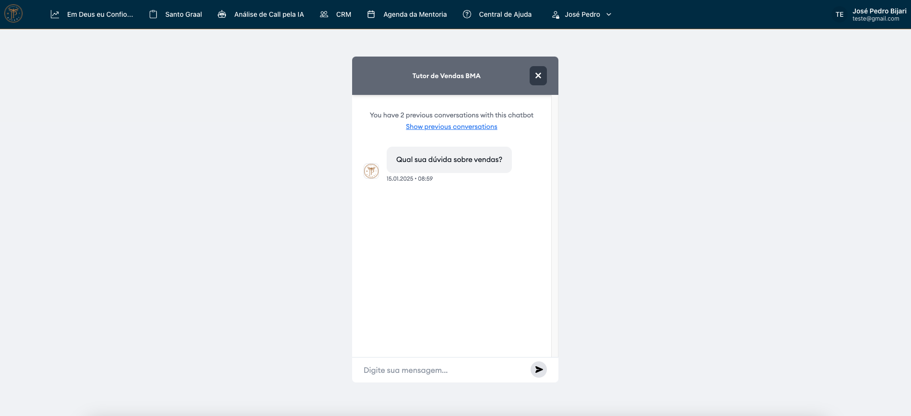
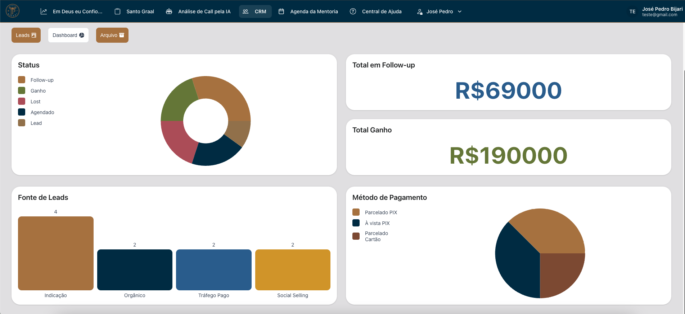

# Portal de Mentoria de Negócios

## Descrição
O **Portal de Mentoria de Negócios** é uma solução inovadora que oferece um ecossistema completo para mentores e suas equipes gerenciarem mentorias de forma eficaz. A plataforma combina análises de dados, gestão de tarefas, acompanhamento de resultados e automação inteligente com IA. Com uma interface moderna e intuitiva, o portal foi projetado para atender às necessidades específicas de mentorados e equipes de suporte ao cliente (CS).

## Funcionalidades

### **1. Dashboard Personalizado**
- Visão geral clara das principais métricas de negócios:
  - **Faturamento:** Meta estipulada, faturamento realizado e caixa.
  - **Operacional:** Agendamentos, reuniões realizadas e vendas.
  - **Custos:** Valores por agendamento, reunião e venda.
- Gráficos e indicadores de progresso para metas financeiras e operacionais.
- Premiações baseadas no desempenho, incentivando o alcance de metas.

### **2. Plano de Ação**
- Organização das tarefas dos mentorados:
  - Divisão em status: **A Fazer**, **Em Andamento** e **Feito**.
  - Sistema de **Sprints** para planejamento e execução de metas em ciclos.
  - Cenários personalizáveis para adaptação de estratégias a diferentes perfis de mentorados.
- Ferramenta essencial para a organização e validação das ações necessárias ao sucesso.

### **3. Área de CS (Customer Success)**
- **Acompanhamento de Dados do Mentorado:**
  - Métricas detalhadas como leads qualificados, agendamentos, calls realizadas, vendas e CAC (Custo de Aquisição de Cliente).
  - Comparativo de custos por lead qualificado, agendamento e call.
- **Gestão de Respostas e Ferramentas:**
  - Consolidação das respostas fornecidas pelos mentorados em diversas ferramentas.
  - Visualização detalhada para análise de desempenho e identificação de pontos de melhoria.

### **4. CRM Inteligente**
- **Gestão de Leads e Vendas:**
  - Sistema Kanban com os status: **Lead**, **Qualificado**, **Agendado**, **Follow-up**, **Ganho** e **Perdido**.
  - Registro detalhado de cada lead, incluindo status, fonte de aquisição e método de pagamento.
- **Análises Visuais:**
  - Gráficos de desempenho: status dos leads, fontes de aquisição e métodos de pagamento.
  - Relatórios financeiros e operacionais detalhados.

### **5. Análise de Calls por IA**
- Ferramenta de Inteligência Artificial que analisa as calls realizadas com leads:
  - Identifica padrões de desempenho e pontos de melhoria.
  - Sugere estratégias personalizadas para aumentar a conversão.

### **6. Progresso e Metas**
- Acompanhamento detalhado do progresso em relação às metas estipuladas.
- Sistema de premiações para desempenho excepcional:
  - Consultorias individuais.
  - Estudos de caso personalizados.
  - Outros incentivos, como entrevistas em podcasts e prêmios surpresa.

---

## Tecnologias Utilizadas
- **Supabase**: Banco de dados relacional para armazenamento de dados.
- **IA:** API da OpenAI para análise de dados, treinamento do tutor e recomendações inteligentes.
- **n8n**: Automação dos processos de back-end.
- **Chart.js**: Visualização de dados em gráficos interativos.
- **Ferramenta no-code**: Desenvolvimento do front-end responsivo e interativo.

---

## Imagens do Projeto

### **Dashboard**

### **Plano de Ação**

### **Área de CS**

### **CRM**

### **Caixa de Ferramentas**

### **Tutor de Vendas com IA**

### **CRM Dashboard**

---

## Como Utilizar
Este repositório foi criado para apresentar as funcionalidades e a estrutura do **Portal de Mentoria de Negócios**. Por motivos de confidencialidade, o código-fonte não está disponível, mas você pode visualizar as funcionalidades por meio das capturas de tela e descrição.

---

## Licença
Este projeto está protegido e não possui uma licença pública. Para mais informações, entre em contato.

## Contato
Se você deseja saber mais sobre este projeto ou obter uma demonstração, entre em contato:
- LinkedIn: [Dayana de Paula](https://linkedin.com/in/dayana-depaula)
